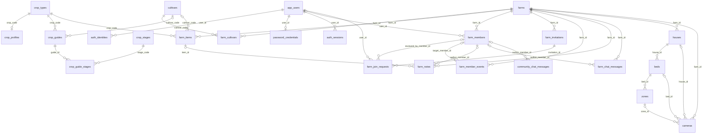
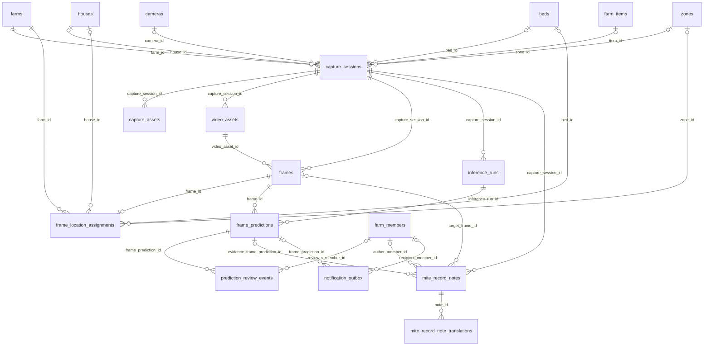
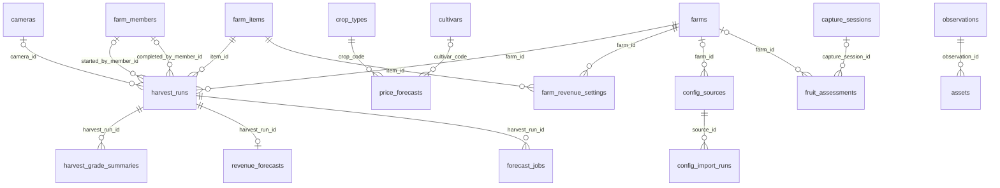

# 농토리 운영센터 애플리케이션

이 문서는 기존 `농토리 운영센터` Site에서 편입한 실행 애플리케이션의 구조와 데이터 계약을 설명합니다. 프로젝트 전체 정책과 우선순위는 루트 [`README.md`](../README.md), 현재 작업 상태는 [`ACTIVE_WORK.md`](../ACTIVE_WORK.md)를 우선합니다.

농가별 작물·품종·하우스·베드·구역 정보를 기준으로 저장 영상 판독, 딸기 성숙도·등급 판정, 응애 조기예찰, 현장 검수, 수확 기록과 예상 수익을 한곳에서 관리하는 농토리 웹/PWA입니다.

이하 기능 설명은 원본 Site 문서에서 이관한 내용입니다. 이번 편입에서는 모델 가중치·실데이터·현장 성능을 검증하지 않았으며, 실행 소스의 존재를 모델/현장 검증 완료로 간주하지 않습니다. 원본 문서가 정의한 적용 대상은 딸기 `설향`이고, 농장과 품목 구조는 다른 작물과 품종을 추가할 수 있도록 구성되어 있습니다. 검증 범위는 [편입 기록](APPLICATION_SOURCE_INTEGRATION.md)을 참고합니다.

## 실행

```bash
pnpm install
pnpm dev
```

검증 명령은 다음과 같습니다.

```bash
pnpm lint
pnpm build
```

Cloudflare 바인딩은 [`.openai/hosting.json`](../.openai/hosting.json)에 정의합니다.

- `DB`: D1/SQLite 구조·계정·판독 메타데이터
- `FILES`: R2 사진·영상·증거 프레임

사진과 영상을 DB 행에 직접 넣지 않습니다. D1에는 객체 키와 분석 메타데이터만 저장하고 원본 파일은 R2에 둡니다.

## 현재 데이터 원칙

- 업체가 농장·하우스·베드·구역·작물·품종·카메라 연결을 등록합니다.
- 농민과 작업자는 내부 ID나 페어링 ID를 직접 입력하지 않습니다.
- Google Sheets/CSV 원본은 읽기 전용입니다. 원본 수정이나 역동기화를 하지 않고, 정규화된 가져오기 결과만 서비스 DB에 기록합니다.
- 같은 대상이 연속 프레임에 보이면 `track_id`로 묶는 것이 최종 목표입니다. 현재 현장 의견 목록은 프레임 단위이며 UI에서 페이지로 나눠 표시합니다.
- 사용자 화면에는 DB 구조나 테스트 레코드를 노출하지 않습니다. 개발·운영 확인은 이 문서와 DB 도구에서 수행합니다.

세부 다농가 원칙은 [`MULTI_FARM_DATA_MODEL.md`](MULTI_FARM_DATA_MODEL.md)를 참고하세요.

캐릭터 외형·의상·활용 범위는 [`TORI_CHARACTER_STANDARD.md`](TORI_CHARACTER_STANDARD.md)를 따릅니다. 화면에서 사용하는 canonical 자산은 [`../assets/nongtori-tori.webp`](../assets/nongtori-tori.webp)이며, 이 서비스에는 농토리만 사용합니다.

## 데이터베이스 구조

DB 정의의 기준은 [`db/schema.ts`](../db/schema.ts), 변경 이력은 [`drizzle`](../drizzle)입니다. 현재 구조는 농장 대화와 이용자 라운지를 포함해 48개 테이블로 구성됩니다.

| 기능군 | 수 | 테이블 |
|---|---:|---|
| 농장·작물 마스터/가이드 | 9 | `farms`, `cultivars`, `farm_cultivars`, `crop_types`, `crop_profiles`, `crop_guides`, `crop_stages`, `crop_guide_stages`, `farm_items` |
| 인증·구성원·협업 | 12 | `app_users`, `auth_identities`, `password_credentials`, `auth_sessions`, `farm_members`, `farm_invitations`, `farm_join_requests`, `farm_member_events`, `farm_notes`, `farm_chat_messages`, `community_chat_messages`, `phone_verification_challenges` |
| 공간·카메라 | 4 | `houses`, `beds`, `zones`, `cameras` |
| 촬영·미디어·AI 판독 | 8 | `capture_sessions`, `capture_assets`, `video_assets`, `frames`, `frame_location_assignments`, `inference_runs`, `frame_predictions`, `prediction_review_events` |
| 응애 의견·알림 | 3 | `mite_record_notes`, `mite_record_note_translations`, `notification_outbox` |
| 수확·가격·수익 | 7 | `harvest_runs`, `harvest_grade_summaries`, `price_forecasts`, `revenue_forecasts`, `forecast_jobs`, `forecast_model_registry`, `farm_revenue_settings` |
| 외부 구성 가져오기 | 2 | `config_sources`, `config_import_runs` |
| 기존 관측·호환 | 3 | `fruit_assessments`, `observations`, `assets` |
| 합계 | **48** | |

### 농장·작물·계정·공간



### 촬영·판독·현장 검수



### 수확·예측·가져오기·기존 관측



### 논리 키와 감사 기록

- `frame_predictions.track_id`: 연속 프레임에서 같은 대상을 묶는 논리 키
- `mite_record_notes.track_key`: 같은 현장 확인 사건의 의견을 묶는 논리 키
- `mite_record_notes.parent_note_id`: 답글 구조용 논리 ID
- `author_*_snapshot`: 구성원 계정을 삭제하거나 교체해도 당시 작성자를 기록에 남기기 위한 스냅샷
- `status = DELETED`: 의견·대화는 물리 삭제 대신 화면에서 숨기고 감사 흔적을 보존
- `community_chat_messages`: 승인된 서비스 이용자의 전역 텍스트 대화입니다. 농장 ID·농장명·위치 컬럼을 두지 않고 최근 50개만 조회합니다.

## 테스트 데이터 확인

기본 작물·설향·작물 가이드 데이터는 [`db/index.ts`](../db/index.ts)의 멱등 초기화 구문으로 준비됩니다. 농장·사용자·촬영·판독 테스트 데이터는 로컬 D1에만 두며 운영 사용자 화면에는 표시하지 않습니다.

확인 시 개인정보, 인증 토큰, 전화번호, 원본 이미지 경로를 README나 커밋에 복사하지 마세요. 테스트용 메모·챗 데이터도 실제 농장과 분리된 로컬 농장 ID를 사용합니다.
